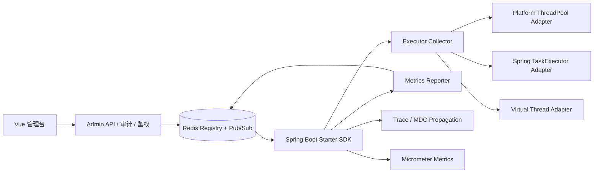

# Atluofu Dynamic Thread Pool 升级需求说明文档

> 项目：`atluofu-dynamic-thread-pool`  
> 目标版本：JDK 21 + Spring Boot 3.5.x  
> 文档版本：v1.0  
> 文档类型：需求说明 / PRD / 技术需求文档  
> 核心目标：动态线程池框架升级为支持传统线程池、虚拟线程、MDC/TraceId 上下文传播、指标观测和执行器治理的异步执行治理框架。

---

## 1. 背景说明

当前 `atluofu-dynamic-thread-pool` 已具备基础动态线程池能力，包括：

- Admin 管理端；
- Spring Boot Starter SDK；
- Redis 注册、配置存储与发布订阅；
- 线程池参数动态调整；
- 线程池状态上报；
- Vue UI 可视化管理。

现阶段框架主要围绕 `ThreadPoolExecutor` 的 `corePoolSize`、`maximumPoolSize`、`activeCount`、`poolSize`、`queueSize` 等传统线程池指标展开。

随着 JDK 21 和 Spring Boot 3.5 的使用，需要进一步支持：

1. JDK 21 运行时；
2. Spring Boot 3.5 自动装配规范；
3. MDC 日志上下文传播；
4. traceId / requestId 异步链路追踪；
5. 虚拟线程执行器；
6. `Runnable`、`Callable`、`CompletableFuture` 等用户自定义异步任务的上下文保护；
7. Redis 消息链路的 trace 透传；
8. 传统线程池与虚拟线程的统一治理。

本次升级不应只停留在“修改依赖版本”，而应将项目从“动态调整线程池参数的工具”升级为“Executor Governance Framework”。

---

## 2. 升级目标

### 2.1 技术栈目标

| 项目 | 当前/原有方向 | 升级目标 |
|---|---|---|
| JDK | Java 17 | Java 21 |
| Spring Boot | 3.1.x | 3.5.x |
| 自动装配 | `spring.factories` | `AutoConfiguration.imports` |
| 执行器模型 | `ThreadPoolExecutor` 为主 | 统一 `ManagedExecutor` 抽象 |
| 日志上下文 | 无统一保障 | MDC / traceId / requestId 自动传播 |
| 虚拟线程 | 不支持 | 支持 Virtual Thread Per Task 模型 |
| 监控 | Redis 状态展示 | Redis + Micrometer 双通道 |
| 管理能力 | 参数调整 | 参数调整、并发限流、审计、回滚、指标观测 |

### 2.2 业务目标

升级后框架应满足以下目标：

1. 支持 Spring Boot 3.5 应用快速接入；
2. 支持 JDK 21 虚拟线程；
3. 支持传统线程池动态调整；
4. 支持虚拟线程并发限制动态调整；
5. 支持异步任务 MDC 上下文不丢失；
6. 支持 traceId 在 Admin、Redis、SDK、业务任务日志中贯穿；
7. 支持多应用、多实例、多执行器统一注册与管理；
8. 支持未来扩展注册中心、指标系统、告警系统和 Web UI。

---

## 3. 范围说明

### 3.1 本次升级范围

本次升级包含以下内容：

- JDK 21 适配；
- Spring Boot 3.5 适配；
- Starter 自动装配升级；
- 执行器抽象重构；
- 传统线程池管理增强；
- 虚拟线程执行器支持；
- MDC / TraceId 上下文传播；
- 用户自定义 `Runnable` / `Callable` / `Supplier` 包装能力；
- `CompletableFuture` 场景支持；
- Redis 配置变更消息 trace 透传；
- 线程池状态模型重构；
- Admin API 重构；
- 监控指标升级；
- 审计和回滚预留。

### 3.2 暂不纳入范围

以下内容本次暂不作为强制目标：

- 完整链路追踪平台建设；
- OpenTelemetry 强制集成；
- Prometheus / Grafana Dashboard 成品交付；
- 多注册中心同时支持；
- 分布式配置强一致性；
- 权限系统完整 RBAC；
- 线程池参数自动调优算法；
- 基于 AI 的容量预测。

---

## 4. 术语定义

| 术语 | 含义 |
|---|---|
| DTP | Dynamic Thread Pool，动态线程池框架 |
| Admin | 动态线程池管理端 |
| SDK / Starter | 接入业务应用的 Spring Boot Starter |
| ManagedExecutor | 框架内部统一执行器抽象 |
| Platform Thread | JDK 传统平台线程 |
| Virtual Thread | JDK 21 虚拟线程 |
| MDC | Mapped Diagnostic Context，日志上下文 |
| traceId | 一次请求或一次操作的链路追踪 ID |
| requestId | 请求 ID，可与 traceId 相同，也可独立 |
| Context Propagation | 上下文传播，指 traceId、MDC 等信息在线程切换后仍可访问 |
| Snapshot | 执行器当前运行状态快照 |
| Resize | 动态调整传统线程池参数 |
| Concurrency Limit | 虚拟线程执行器并发上限 |

---

## 5. 现状问题

### 5.1 执行器模型过于单一

当前框架主要面向 `ThreadPoolExecutor`，因此天然围绕以下字段设计：

- `corePoolSize`
- `maximumPoolSize`
- `activeCount`
- `poolSize`
- `queueSize`
- `completedTaskCount`

该模型无法自然支持虚拟线程。

虚拟线程不是传统意义上的线程池，不应该通过 `corePoolSize` 和 `maximumPoolSize` 管理，而应该通过并发限制、任务统计和执行边界治理。

### 5.2 MDC 在线程切换后容易丢失

MDC 基于线程上下文保存数据。业务请求进入主线程后，MDC 中可能存在：

```text
traceId
requestId
userId
tenantId
bizId
```

但当代码切换到异步线程时，MDC 默认不会自动传播。

高风险场景包括：

```java
executor.execute(() -> log.info("async task"));

executor.submit(() -> {
    log.info("callable task");
    return "ok";
});

CompletableFuture.supplyAsync(() -> service.query());

Thread.startVirtualThread(() -> log.info("virtual task"));

new Thread(() -> log.info("manual thread")).start();
```

如果框架不处理这些场景，业务日志会出现 traceId 丢失，导致排查问题困难。

### 5.3 Redis 配置变更链路缺少 trace

当前 Admin 修改线程池配置后，通过 Redis 发布消息到 SDK。若消息体中不包含 traceId / requestId，则 Admin 日志、Redis Listener 日志、SDK 调整日志无法串联。

### 5.4 多应用、多实例状态隔离不足

如果状态上报只使用全局 Key 或全局 List，多个应用、多个实例可能互相覆盖，无法准确展示每个实例的执行器状态。

### 5.5 缺少审计和回滚能力

线程池参数属于运行时关键配置。修改后需要记录：

- 谁修改；
- 什么时候修改；
- 修改哪个应用；
- 修改哪个实例；
- 修改哪个执行器；
- 修改前是什么；
- 修改后是什么；
- 是否成功；
- 失败原因；
- traceId 是什么。

否则生产事故发生后难以回溯。

---

## 6. 目标架构

### 6.1 总体架构



### 6.2 核心设计原则

1. 传统线程池管理的是“池参数”；
2. 虚拟线程管理的是“并发边界”；
3. TraceId 不是日志格式问题，而是上下文传播问题；
4. 凡是经过 DTP 管理的执行入口，框架应自动保证 MDC 不丢；
5. 凡是不经过 DTP 的异步入口，框架应提供手动包装工具兜底；
6. Admin 修改配置时，消息链路必须携带 traceId；
7. Redis 状态 Key 必须区分 appName、instanceId、executorName。

---

## 7. 模块规划

建议升级后的模块结构如下：

```text
atluofu-dynamic-thread-pool/
├── atluofu-dynamic-thread-pool-core
│   ├── executor
│   ├── model
│   ├── context
│   ├── registry
│   ├── metrics
│   └── support
│
├── atluofu-dynamic-thread-pool-registry-redis
│   ├── RedisRegistry
│   ├── RedisMessagePublisher
│   └── RedisMessageListener
│
├── atluofu-dynamic-thread-pool-spring-boot3-starter
│   ├── autoconfigure
│   ├── properties
│   ├── collector
│   ├── actuator
│   └── decorator
│
├── dynamic-thread-pool-admin
│   ├── api
│   ├── application
│   ├── domain
│   ├── infrastructure
│   └── trigger
│
├── atluofu-dynamic-thread-pool-ui
└── atluofu-dynamic-thread-pool-test
```

---

## 8. 功能需求

## 8.1 JDK 21 与 Spring Boot 3.5 适配

### FR-001：升级 JDK 版本

系统应支持 JDK 21 编译和运行。

#### 要求

- `java.version` 设置为 `21`；
- `maven.compiler.release` 设置为 `21`；
- 删除 JDK 8 时代废弃 JVM 参数；
- 所有模块通过 JDK 21 编译；
- CI 构建环境增加 JDK 21。

#### 验收标准

- 执行 `mvn clean package` 成功；
- 所有测试用例通过；
- 示例应用可在 JDK 21 下启动。

---

### FR-002：升级 Spring Boot 版本

系统应升级到 Spring Boot 3.5.x。

#### 要求

- 父 POM 使用 Spring Boot 3.5.x；
- 使用 Spring Boot 3.5 推荐的依赖管理；
- 兼容 Jakarta 命名空间；
- 移除不必要的老版本插件配置；
- 移除 JUnit4 / Vintage 依赖，统一 JUnit Jupiter。

#### 验收标准

- Admin 模块正常启动；
- Starter 被业务测试应用正常加载；
- Controller、配置属性、自动装配均正常生效。

---

### FR-003：升级 Starter 自动装配方式

Starter 应从 `spring.factories` 迁移到 Spring Boot 3 推荐的自动装配方式。

#### 要求

新增文件：

```text
META-INF/spring/org.springframework.boot.autoconfigure.AutoConfiguration.imports
```

内容示例：

```text
top.atluofu.middleware.dynamic.thread.pool.sdk.autoconfigure.DynamicThreadPoolAutoConfiguration
```

自动配置类应使用：

```java
@AutoConfiguration
@EnableConfigurationProperties(DynamicThreadPoolProperties.class)
@ConditionalOnProperty(
        prefix = "atluofu.dynamic.thread-pool",
        name = "enabled",
        havingValue = "true",
        matchIfMissing = true
)
public class DynamicThreadPoolAutoConfiguration {
}
```

#### 验收标准

- 业务应用引入 starter 后可自动装配；
- 可通过配置关闭 starter；
- 多个 Bean 不应与业务应用已有 Bean 冲突。

---

## 8.2 配置属性需求

### FR-004：统一配置前缀

配置前缀应统一为：

```yaml
atluofu:
  dynamic:
    thread-pool:
      enabled: true
```

完整示例：

```yaml
atluofu:
  dynamic:
    thread-pool:
      enabled: true
      app-name: ${spring.application.name}
      instance-id: ${spring.application.name}-${server.port}
      registry:
        type: redis
        redis:
          host: 127.0.0.1
          port: 6379
          password:
          database: 0
      report:
        enabled: true
        interval: 20s
      trace:
        enabled: true
        mdc-enabled: true
        trace-id-key: traceId
        request-id-key: requestId
      virtual:
        enabled: true
        default-concurrency-limit: 500
```

#### 验收标准

- 配置类能正确绑定；
- 未配置 `app-name` 时默认使用 `spring.application.name`；
- 可单独关闭 trace、report、virtual 模块。

---

## 8.3 执行器统一抽象

### FR-005：新增 ManagedExecutor 抽象

系统应新增统一执行器抽象：

```java
public interface ManagedExecutor {

    String appName();

    String instanceId();

    String executorName();

    ExecutorKind kind();

    ExecutorSnapshot snapshot();

    UpdateResult update(ExecutorUpdateCommand command);

    boolean supportsResize();

    boolean supportsVirtualThread();

    boolean supportsQueueMetrics();
}
```

### FR-006：新增 ExecutorKind

```java
public enum ExecutorKind {
    PLATFORM_THREAD_POOL,
    SPRING_THREAD_POOL_TASK_EXECUTOR,
    VIRTUAL_THREAD_PER_TASK,
    UNKNOWN
}
```

#### 验收标准

- 传统线程池可适配为 `ManagedExecutor`；
- Spring `ThreadPoolTaskExecutor` 可适配为 `ManagedExecutor`；
- 虚拟线程执行器可适配为 `ManagedExecutor`；
- Admin 和 UI 不直接依赖具体线程池类型。

---

## 8.4 传统线程池动态调整

### FR-007：支持传统线程池参数动态调整

传统线程池应支持动态调整：

- `corePoolSize`
- `maximumPoolSize`
- `keepAliveSeconds`
- `allowCoreThreadTimeOut`
- 拒绝策略展示
- 队列类型展示
- 队列容量展示

### FR-008：调整顺序必须安全

当同时调整 `corePoolSize` 和 `maximumPoolSize` 时，应避免非法顺序导致异常。

示例逻辑：

```java
public final class ThreadPoolResizeSupport {

    public static void resize(ThreadPoolExecutor executor, int newCore, int newMax) {
        if (newCore <= 0 || newMax <= 0) {
            throw new IllegalArgumentException("corePoolSize and maximumPoolSize must be positive");
        }

        if (newCore > newMax) {
            throw new IllegalArgumentException("corePoolSize must <= maximumPoolSize");
        }

        int currentCore = executor.getCorePoolSize();
        int currentMax = executor.getMaximumPoolSize();

        if (newMax < currentCore) {
            executor.setCorePoolSize(newCore);
            executor.setMaximumPoolSize(newMax);
        } else if (newCore > currentMax) {
            executor.setMaximumPoolSize(newMax);
            executor.setCorePoolSize(newCore);
        } else {
            executor.setMaximumPoolSize(newMax);
            executor.setCorePoolSize(newCore);
        }
    }
}
```

#### 验收标准

- `corePoolSize <= maximumPoolSize`；
- 调整非法参数时返回明确错误；
- 调整成功后 Redis 快照能显示新参数；
- 调整日志中包含 appName、instanceId、executorName、oldValue、newValue、traceId。

---

## 8.5 虚拟线程支持

### FR-009：支持虚拟线程执行器

系统应支持 JDK 21 虚拟线程执行器。

虚拟线程执行器不应支持以下传统线程池参数：

- `corePoolSize`
- `maximumPoolSize`
- `poolSize`
- `queueSize`

虚拟线程执行器应支持：

- `concurrencyLimit`
- `runningTasks`
- `submittedTasks`
- `completedTasks`
- `failedTasks`
- `rejectedTasks`
- `availablePermits`
- `threadNamePrefix`

### FR-010：虚拟线程通过并发限制治理

系统应提供有界虚拟线程执行器：

```java
public class BoundedVirtualThreadExecutor implements ExecutorService {

    private final ExecutorService delegate;
    private final Semaphore semaphore;
    private final AtomicLong submitted = new AtomicLong();
    private final AtomicLong completed = new AtomicLong();
    private final AtomicLong failed = new AtomicLong();
    private final AtomicLong rejected = new AtomicLong();

    public BoundedVirtualThreadExecutor(String namePrefix, int concurrencyLimit) {
        this.delegate = Executors.newThreadPerTaskExecutor(
                Thread.ofVirtual().name(namePrefix + "-", 0).factory()
        );
        this.semaphore = new Semaphore(concurrencyLimit);
    }

    @Override
    public void execute(Runnable command) {
        submitted.incrementAndGet();

        boolean acquired = semaphore.tryAcquire();
        if (!acquired) {
            rejected.incrementAndGet();
            throw new RejectedExecutionException("Virtual executor concurrency limit exceeded");
        }

        delegate.execute(() -> {
            try {
                command.run();
                completed.incrementAndGet();
            } catch (Throwable ex) {
                failed.incrementAndGet();
                throw ex;
            } finally {
                semaphore.release();
            }
        });
    }
}
```

#### 验收标准

- 可创建虚拟线程执行器；
- 可通过 Admin 修改 `concurrencyLimit`；
- UI 不展示传统线程池的 core/max；
- 虚拟线程任务执行日志 traceId 不丢；
- 并发超过限制时可统计 rejected。

---

## 8.6 MDC / TraceId 上下文传播

### FR-011：请求入口生成 traceId

Admin 和业务测试应用应支持通过 Filter 生成或透传 traceId。

规则：

1. 如果请求头存在 `X-Trace-Id`，优先使用该值；
2. 如果请求头不存在，则生成新的 traceId；
3. 响应头返回 `X-Trace-Id`；
4. MDC 中写入 `traceId` 和 `requestId`；
5. 请求结束后清理 MDC。

示例：

```java
public class DtpTraceIdFilter extends OncePerRequestFilter {

    public static final String TRACE_ID = "traceId";
    public static final String REQUEST_ID = "requestId";

    @Override
    protected void doFilterInternal(
            HttpServletRequest request,
            HttpServletResponse response,
            FilterChain filterChain
    ) throws ServletException, IOException {
        String traceId = Optional.ofNullable(request.getHeader("X-Trace-Id"))
                .filter(StringUtils::hasText)
                .orElseGet(() -> UUID.randomUUID().toString().replace("-", ""));

        String requestId = Optional.ofNullable(request.getHeader("X-Request-Id"))
                .filter(StringUtils::hasText)
                .orElse(traceId);

        try {
            MDC.put(TRACE_ID, traceId);
            MDC.put(REQUEST_ID, requestId);
            response.setHeader("X-Trace-Id", traceId);
            filterChain.doFilter(request, response);
        } finally {
            MDC.remove(TRACE_ID);
            MDC.remove(REQUEST_ID);
        }
    }
}
```

#### 验收标准

- 所有 Admin 请求日志包含 traceId；
- 响应头包含 `X-Trace-Id`；
- 请求结束后 MDC 不残留。

---

### FR-012：新增上下文快照能力

系统应新增 `DtpContextSnapshot`，用于在任务提交时捕获 MDC，在任务执行时恢复 MDC。

```java
public final class DtpContextSnapshot {

    private final Map<String, String> mdcContext;

    private DtpContextSnapshot(Map<String, String> mdcContext) {
        this.mdcContext = mdcContext;
    }

    public static DtpContextSnapshot capture() {
        return new DtpContextSnapshot(MDC.getCopyOfContextMap());
    }

    public Scope restore() {
        Map<String, String> previous = MDC.getCopyOfContextMap();

        if (mdcContext == null || mdcContext.isEmpty()) {
            MDC.clear();
        } else {
            MDC.setContextMap(mdcContext);
        }

        return new Scope(previous);
    }

    public static final class Scope implements AutoCloseable {

        private final Map<String, String> previous;

        private Scope(Map<String, String> previous) {
            this.previous = previous;
        }

        @Override
        public void close() {
            if (previous == null || previous.isEmpty()) {
                MDC.clear();
            } else {
                MDC.setContextMap(previous);
            }
        }
    }
}
```

#### 验收标准

- 能捕获当前线程 MDC；
- 能恢复到执行线程；
- 执行完成后恢复执行线程原始 MDC；
- 不出现 traceId 串号。

---

### FR-013：支持用户自定义 Runnable

系统应提供 `DtpRunnable`，用于包装用户自定义 `Runnable`。

```java
public final class DtpRunnable implements Runnable {

    private final Runnable delegate;
    private final DtpContextSnapshot snapshot;

    private DtpRunnable(Runnable delegate, DtpContextSnapshot snapshot) {
        this.delegate = delegate;
        this.snapshot = snapshot;
    }

    public static Runnable wrap(Runnable runnable) {
        if (runnable instanceof DtpRunnable) {
            return runnable;
        }
        return new DtpRunnable(runnable, DtpContextSnapshot.capture());
    }

    @Override
    public void run() {
        try (DtpContextSnapshot.Scope ignored = snapshot.restore()) {
            delegate.run();
        }
    }
}
```

#### 验收标准

- 用户手写 `Runnable` 后可通过 `DtpRunnable.wrap()` 保持 MDC；
- DTP 管理的 Executor 应自动包装 `Runnable`；
- 重复包装不会造成嵌套污染。

---

### FR-014：支持用户自定义 Callable

系统应提供 `DtpCallable`，用于包装用户自定义 `Callable`。

```java
public final class DtpCallable<V> implements Callable<V> {

    private final Callable<V> delegate;
    private final DtpContextSnapshot snapshot;

    private DtpCallable(Callable<V> delegate, DtpContextSnapshot snapshot) {
        this.delegate = delegate;
        this.snapshot = snapshot;
    }

    public static <V> Callable<V> wrap(Callable<V> callable) {
        if (callable instanceof DtpCallable<V>) {
            return callable;
        }
        return new DtpCallable<>(callable, DtpContextSnapshot.capture());
    }

    @Override
    public V call() throws Exception {
        try (DtpContextSnapshot.Scope ignored = snapshot.restore()) {
            return delegate.call();
        }
    }
}
```

#### 验收标准

- 用户手写 `Callable` 后可通过 `DtpCallable.wrap()` 保持 MDC；
- DTP 管理的 ExecutorService 应自动包装 `Callable`；
- 任务异常时 MDC 也能正确清理。

---

### FR-015：支持 CompletableFuture Supplier

系统应提供 `DtpSupplier`，用于 `CompletableFuture.supplyAsync()` 场景。

```java
public final class DtpSupplier<T> implements Supplier<T> {

    private final Supplier<T> delegate;
    private final DtpContextSnapshot snapshot;

    private DtpSupplier(Supplier<T> delegate, DtpContextSnapshot snapshot) {
        this.delegate = delegate;
        this.snapshot = snapshot;
    }

    public static <T> Supplier<T> wrap(Supplier<T> supplier) {
        if (supplier instanceof DtpSupplier<T>) {
            return supplier;
        }
        return new DtpSupplier<>(supplier, DtpContextSnapshot.capture());
    }

    @Override
    public T get() {
        try (DtpContextSnapshot.Scope ignored = snapshot.restore()) {
            return delegate.get();
        }
    }
}
```

#### 验收标准

以下场景 traceId 不丢：

```java
CompletableFuture.supplyAsync(
        DtpSupplier.wrap(() -> service.query())
);
```

如果使用 DTP 管理的 Executor，则用户不需要手动包装：

```java
CompletableFuture.supplyAsync(
        () -> service.query(),
        orderExecutor
);
```

---

### FR-016：支持 Function / Consumer / BiFunction 等函数式接口

系统可扩展支持：

- `DtpFunction`
- `DtpConsumer`
- `DtpBiFunction`
- `DtpBiConsumer`
- `DtpSupplier`
- `DtpRunnable`
- `DtpCallable`

用于 `CompletableFuture.thenApplyAsync()`、`thenAcceptAsync()`、`handleAsync()` 等场景。

#### 验收标准

以下场景 traceId 不丢：

```java
CompletableFuture
        .supplyAsync(DtpSupplier.wrap(() -> queryOrder()))
        .thenApplyAsync(DtpFunction.wrap(order -> enrich(order)))
        .thenAcceptAsync(DtpConsumer.wrap(order -> save(order)));
```

---

## 8.7 Context-Aware Executor

### FR-017：自动包装 ExecutorService

系统应提供 `DtpContextAwareExecutorService`，自动包装：

- `execute(Runnable)`
- `submit(Runnable)`
- `submit(Runnable, T)`
- `submit(Callable<T>)`
- `invokeAll(Collection<Callable<T>>)`
- `invokeAny(Collection<Callable<T>>)`

示例：

```java
public class DtpContextAwareExecutorService extends AbstractExecutorService {

    private final ExecutorService delegate;

    public DtpContextAwareExecutorService(ExecutorService delegate) {
        this.delegate = delegate;
    }

    @Override
    public void execute(Runnable command) {
        delegate.execute(DtpRunnable.wrap(command));
    }

    @Override
    public Future<?> submit(Runnable task) {
        return delegate.submit(DtpRunnable.wrap(task));
    }

    @Override
    public <T> Future<T> submit(Callable<T> task) {
        return delegate.submit(DtpCallable.wrap(task));
    }

    @Override
    public void shutdown() {
        delegate.shutdown();
    }

    @Override
    public List<Runnable> shutdownNow() {
        return delegate.shutdownNow();
    }

    @Override
    public boolean isShutdown() {
        return delegate.isShutdown();
    }

    @Override
    public boolean isTerminated() {
        return delegate.isTerminated();
    }

    @Override
    public boolean awaitTermination(long timeout, TimeUnit unit)
            throws InterruptedException {
        return delegate.awaitTermination(timeout, unit);
    }
}
```

#### 验收标准

- 用户通过 DTP Executor 提交任务时无需手动包装；
- `execute` 和 `submit` 均能自动传播 MDC；
- `invokeAll` 和 `invokeAny` 支持 MDC；
- 任务执行后不污染工作线程。

---

### FR-018：支持 ScheduledExecutorService

系统应提供 `DtpContextAwareScheduledExecutorService`。

应支持：

- `schedule(Runnable, delay, unit)`
- `schedule(Callable, delay, unit)`
- `scheduleAtFixedRate`
- `scheduleWithFixedDelay`

#### 注意事项

定时任务的 MDC 语义需要明确：

1. 一次性延迟任务：提交时捕获 MDC；
2. 周期性任务：默认使用提交时 MDC；
3. 如果希望每次执行重新生成 traceId，应提供配置项。

建议配置：

```yaml
atluofu:
  dynamic:
    thread-pool:
      trace:
        scheduled-mode: CAPTURE_ON_SUBMIT
```

可选值：

```text
CAPTURE_ON_SUBMIT
GENERATE_EACH_RUN
DISABLED
```

#### 验收标准

- 延迟任务 traceId 不丢；
- 周期任务可配置 MDC 传播策略；
- 周期任务异常时 MDC 正确清理。

---

## 8.8 Spring TaskDecorator 支持

### FR-019：提供 DtpTaskDecorator

系统应提供 Spring `TaskDecorator` 实现。

```java
public class DtpTaskDecorator implements TaskDecorator {

    @Override
    public Runnable decorate(Runnable runnable) {
        return DtpRunnable.wrap(runnable);
    }
}
```

#### 验收标准

- 用户使用 `ThreadPoolTaskExecutor` 时可配置该 Decorator；
- Starter 可在合适条件下自动注入 Decorator；
- 不影响用户自定义 Decorator；
- 如用户已有 Decorator，应提供组合 Decorator 能力。

---

## 8.9 用户手动线程创建工具

### FR-020：提供 DtpThreads 工具类

对于框架无法自动拦截的手动线程创建场景，应提供工具类：

```java
public final class DtpThreads {

    private DtpThreads() {
    }

    public static Thread startVirtualThread(Runnable task) {
        return Thread.startVirtualThread(DtpRunnable.wrap(task));
    }

    public static Thread newPlatformThread(String name, Runnable task) {
        return Thread.ofPlatform()
                .name(name)
                .unstarted(DtpRunnable.wrap(task));
    }

    public static Thread newVirtualThread(String name, Runnable task) {
        return Thread.ofVirtual()
                .name(name)
                .unstarted(DtpRunnable.wrap(task));
    }
}
```

#### 验收标准

以下场景可手动保证 MDC 不丢：

```java
DtpThreads.startVirtualThread(() -> {
    log.info("virtual task with traceId");
});
```

---

## 8.10 MDC 支持矩阵

### FR-021：框架应明确 MDC / TraceId 支持矩阵

| 场景 | 是否自动支持 | 处理方式 |
|---|---:|---|
| DTP 管理的 `ThreadPoolExecutor` | 是 | 框架自动包装 `Runnable` / `Callable` |
| DTP 管理的 `ExecutorService` | 是 | `DtpContextAwareExecutorService` |
| DTP 管理的虚拟线程执行器 | 是 | 执行前恢复 MDC |
| Spring `ThreadPoolTaskExecutor` | 是 | `DtpTaskDecorator` |
| `CompletableFuture` + DTP Executor | 是 | DTP Executor 自动包装 |
| `CompletableFuture` 默认 `commonPool` | 否 | 使用 `DtpSupplier.wrap` 等工具 |
| 用户手动 `new Thread` | 否 | 使用 `DtpThreads` 或 `DtpRunnable.wrap` |
| 用户手动 `Thread.startVirtualThread` | 否 | 使用 `DtpThreads.startVirtualThread` |
| 第三方 SDK 内部线程池 | 否 | 需要 SDK hook 或手动包装 callback |
| Redis Listener 内部处理 | 是 | 消息体 traceId 写入 MDC |
| 定时任务 | 部分支持 | 根据 scheduled-mode 配置 |

---

## 8.11 Redis 消息 trace 透传

### FR-022：配置变更消息体增加 trace 信息

Admin 发布配置变更消息时，应使用统一 envelope。

```java
public record DtpConfigChangeMessage(
        String messageId,
        String traceId,
        String requestId,
        String appName,
        String instanceId,
        String executorName,
        ExecutorKind executorKind,
        DtpUpdatePayload payload,
        String operator,
        Instant timestamp
) {}
```

#### 验收标准

- Admin 发布消息时带 traceId；
- SDK Listener 收到消息后写入 MDC；
- SDK 调整线程池日志中包含同一 traceId；
- 调整完成后清理 MDC。

---

### FR-023：SDK Listener 处理消息时恢复 MDC

```java
public void onMessage(CharSequence channel, DtpConfigChangeMessage message) {
    try {
        MDC.put("traceId", message.traceId());
        MDC.put("requestId", message.requestId());

        managedExecutorRegistry
                .get(message.executorName())
                .update(message.toCommand());

        reporter.reportNow();
    } finally {
        MDC.clear();
    }
}
```

#### 验收标准

- Redis 消息链路日志 traceId 贯穿；
- 消息处理失败时也要清理 MDC；
- 失败日志包含失败原因和 traceId。

---

## 8.12 状态上报和 Redis Key 设计

### FR-024：Redis Key 应支持多应用多实例

建议 Key 设计：

```text
DTP:APPS
DTP:APP:{appName}:INSTANCES
DTP:SNAPSHOT:{appName}:{instanceId}:{executorName}
DTP:CHANGE_TOPIC:{appName}
DTP:EVENT:{appName}:{yyyyMMdd}
```

#### 验收标准

- 不同应用状态不互相覆盖；
- 同一应用不同实例状态不互相覆盖；
- 同一实例不同执行器状态不互相覆盖；
- 实例下线后状态可过期清理。

---

## 8.13 指标监控

### FR-025：支持 Micrometer 指标暴露

系统应支持 Micrometer 指标。

建议指标名：

```text
dtp.executor.active
dtp.executor.pool.size
dtp.executor.pool.core
dtp.executor.pool.max
dtp.executor.queue.size
dtp.executor.queue.remaining
dtp.executor.completed
dtp.executor.rejected
dtp.executor.virtual.running
dtp.executor.virtual.submitted
dtp.executor.virtual.completed
dtp.executor.virtual.failed
dtp.executor.virtual.permits.available
```

建议 tags：

```text
appName
instanceId
executorName
executorKind
virtual
```

#### 验收标准

- 引入 actuator 后可查看指标；
- Prometheus 可采集；
- 虚拟线程和传统线程池指标区分清晰。

---

## 8.14 Admin API 需求

### FR-026：Admin API REST 化

建议接口：

```text
GET  /api/v1/dtp/apps
GET  /api/v1/dtp/apps/{appName}/instances
GET  /api/v1/dtp/apps/{appName}/instances/{instanceId}/executors
GET  /api/v1/dtp/apps/{appName}/instances/{instanceId}/executors/{executorName}
POST /api/v1/dtp/apps/{appName}/instances/{instanceId}/executors/{executorName}/resize
POST /api/v1/dtp/apps/{appName}/instances/{instanceId}/executors/{executorName}/virtual-limit
GET  /api/v1/dtp/events
POST /api/v1/dtp/events/{eventId}/rollback
```

### 传统线程池调整请求

```json
{
  "corePoolSize": 20,
  "maximumPoolSize": 80,
  "keepAliveSeconds": 60,
  "operator": "admin"
}
```

### 虚拟线程并发限制调整请求

```json
{
  "concurrencyLimit": 1000,
  "operator": "admin"
}
```

### 统一响应

```json
{
  "code": "0000",
  "message": "success",
  "traceId": "b39a7d4b9e7c4bc8b3ad64cb81d9a999",
  "data": true
}
```

#### 验收标准

- 所有响应包含 traceId；
- 参数校验失败返回明确错误；
- 调整成功后生成事件记录；
- 调整失败后不污染现有配置。

---

## 8.15 审计与回滚

### FR-027：记录配置变更事件

每一次配置变更都应记录事件。

字段建议：

```text
eventId
traceId
requestId
appName
instanceId
executorName
executorKind
operator
operationType
beforeValue
afterValue
success
errorMessage
createdAt
```

### FR-028：支持回滚

系统应支持基于历史事件回滚。

#### 验收标准

- 可查询历史变更；
- 可查看修改前后配置；
- 可选择某条成功事件进行回滚；
- 回滚本身也要生成新的事件；
- 回滚日志包含 traceId。

---

## 9. 数据模型设计

## 9.1 ExecutorSnapshot

```java
public class ExecutorSnapshot {

    private String appName;
    private String instanceId;
    private String executorName;
    private ExecutorKind executorKind;

    private boolean virtual;
    private boolean resizable;

    private Integer corePoolSize;
    private Integer maximumPoolSize;
    private Integer activeCount;
    private Integer poolSize;
    private Long taskCount;
    private Long completedTaskCount;

    private String queueType;
    private Integer queueSize;
    private Integer remainingCapacity;

    private Integer concurrencyLimit;
    private Integer availablePermits;
    private Long submittedTasks;
    private Long failedTasks;
    private Long rejectedTasks;

    private Instant reportTime;
}
```

## 9.2 ExecutorUpdateCommand

```java
public class ExecutorUpdateCommand {

    private String appName;
    private String instanceId;
    private String executorName;
    private ExecutorKind executorKind;

    private Integer corePoolSize;
    private Integer maximumPoolSize;
    private Long keepAliveSeconds;
    private Boolean allowCoreThreadTimeOut;

    private Integer concurrencyLimit;

    private String traceId;
    private String requestId;
    private String operator;
    private Long version;
}
```

## 9.3 UpdateResult

```java
public class UpdateResult {

    private boolean success;
    private String message;
    private ExecutorSnapshot before;
    private ExecutorSnapshot after;
}
```

---

## 10. 用户使用方式

## 10.1 推荐使用 DTP Executor

```java
@Resource
private ExecutorService orderExecutor;

public void createOrder(OrderCommand command) {
    log.info("receive create order request");

    orderExecutor.submit(() -> {
        log.info("async create order task");
        orderService.doCreate(command);
    });
}
```

特点：

- 用户不需要手动处理 MDC；
- DTP 自动包装任务；
- 日志 traceId 不丢；
- 线程池可监控、可动态调整。

---

## 10.2 CompletableFuture 推荐写法

推荐：

```java
CompletableFuture<OrderInfo> orderFuture =
        CompletableFuture.supplyAsync(
                () -> orderService.queryOrder(orderId),
                orderExecutor
        );
```

不推荐：

```java
CompletableFuture.supplyAsync(() -> orderService.queryOrder(orderId));
```

原因：

- 默认使用 `ForkJoinPool.commonPool()`；
- DTP 无法监控；
- MDC 默认可能丢失。

如果必须使用默认线程池，需要手动包装：

```java
CompletableFuture<OrderInfo> orderFuture =
        CompletableFuture.supplyAsync(
                DtpSupplier.wrap(() -> orderService.queryOrder(orderId))
        );
```

---

## 10.3 手动线程创建

不推荐：

```java
new Thread(() -> log.info("manual thread")).start();
```

推荐：

```java
DtpThreads.newPlatformThread("manual-worker", () -> {
    log.info("manual thread with traceId");
}).start();
```

虚拟线程推荐：

```java
DtpThreads.startVirtualThread(() -> {
    log.info("virtual task with traceId");
});
```

---

## 11. 非功能需求

## 11.1 稳定性

- 动态调整失败不得影响业务线程池继续运行；
- Redis 不可用时业务应用不能启动失败，除非配置为 fail-fast；
- 上报失败不能阻塞业务任务执行；
- MDC 包装异常不能吞掉用户任务异常。

## 11.2 性能

- MDC 捕获和恢复应轻量；
- 指标采集不应频繁加锁；
- 状态上报周期默认不低于 10 秒；
- 虚拟线程并发限制应使用轻量并发控制结构，例如 `Semaphore`。

## 11.3 可观测性

- 关键日志必须包含 traceId；
- 配置变更必须可审计；
- 调整失败必须有明确错误；
- 指标应覆盖传统线程池和虚拟线程执行器。

## 11.4 兼容性

- 支持 Spring Boot 3.5.x；
- 支持 JDK 21；
- 支持传统 `ThreadPoolExecutor`；
- 支持 Spring `ThreadPoolTaskExecutor`；
- 支持 JDK 21 Virtual Thread；
- 不强制业务系统接入 OpenTelemetry。

## 11.5 可扩展性

- 注册中心应可扩展；
- 指标后端应可扩展；
- 上下文传播内容应可扩展；
- 执行器类型应可扩展。

---

## 12. 测试需求

## 12.1 单元测试

需要覆盖：

- `DtpContextSnapshot`
- `DtpRunnable`
- `DtpCallable`
- `DtpSupplier`
- `DtpContextAwareExecutorService`
- `BoundedVirtualThreadExecutor`
- `ThreadPoolResizeSupport`

## 12.2 集成测试

需要覆盖：

1. Starter 自动装配；
2. 业务应用接入后自动注册线程池；
3. Admin 修改配置后 SDK 生效；
4. Redis 消息 traceId 贯穿；
5. DTP Executor 中 MDC 不丢；
6. CompletableFuture + DTP Executor 中 MDC 不丢；
7. 虚拟线程执行器中 MDC 不丢；
8. 非法参数调整失败；
9. 多实例状态隔离；
10. 指标可通过 actuator 暴露。

## 12.3 MDC 重点测试用例

### 用例 1：Runnable

```java
MDC.put("traceId", "trace-001");

executor.execute(() -> {
    assertEquals("trace-001", MDC.get("traceId"));
});
```

### 用例 2：Callable

```java
MDC.put("traceId", "trace-002");

Future<String> future = executor.submit(() -> MDC.get("traceId"));

assertEquals("trace-002", future.get());
```

### 用例 3：CompletableFuture

```java
MDC.put("traceId", "trace-003");

CompletableFuture<String> future =
        CompletableFuture.supplyAsync(() -> MDC.get("traceId"), executor);

assertEquals("trace-003", future.get());
```

### 用例 4：虚拟线程

```java
MDC.put("traceId", "trace-004");

virtualExecutor.submit(() -> {
    assertEquals("trace-004", MDC.get("traceId"));
});
```

### 用例 5：MDC 不串号

```java
MDC.put("traceId", "trace-A");
executor.submit(() -> assertEquals("trace-A", MDC.get("traceId"))).get();

MDC.put("traceId", "trace-B");
executor.submit(() -> assertEquals("trace-B", MDC.get("traceId"))).get();
```

---

## 13. 里程碑计划

## Phase 1：基础升级

目标：JDK 21 + Spring Boot 3.5 正常运行。

任务：

- 升级 parent POM；
- 升级 Java 版本；
- 清理老旧依赖；
- 迁移自动装配；
- 修复测试；
- 示例应用启动成功。

交付物：

- 可运行的 Admin；
- 可运行的 Starter；
- 基础测试通过。

---

## Phase 2：执行器抽象重构

目标：框架不再只依赖 `ThreadPoolExecutor`。

任务：

- 新增 `ManagedExecutor`；
- 新增 `ExecutorKind`；
- 新增 `ExecutorSnapshot`；
- 新增 `ExecutorUpdateCommand`；
- 适配传统线程池；
- 适配 Spring `ThreadPoolTaskExecutor`。

交付物：

- 统一执行器注册表；
- 多执行器类型快照展示；
- 传统线程池动态调整正常。

---

## Phase 3：MDC / TraceId 上下文传播

目标：异步任务 traceId 不丢。

任务：

- 新增 `DtpContextSnapshot`；
- 新增 `DtpRunnable`；
- 新增 `DtpCallable`；
- 新增 `DtpSupplier`；
- 新增 `DtpContextAwareExecutorService`；
- 新增 `DtpTaskDecorator`；
- 新增 `DtpThreads`；
- Redis 消息体增加 traceId。

交付物：

- MDC 传播工具；
- 自动包装 Executor；
- MDC 测试用例全部通过。

---

## Phase 4：虚拟线程支持

目标：支持 JDK 21 Virtual Thread。

任务：

- 新增 `BoundedVirtualThreadExecutor`；
- 新增虚拟线程快照；
- 支持 `concurrencyLimit` 动态调整；
- UI 区分传统线程池和虚拟线程；
- 虚拟线程 MDC 测试。

交付物：

- 虚拟线程执行器；
- 虚拟线程并发治理；
- 虚拟线程指标展示。

---

## Phase 5：观测与生产化

目标：具备生产可用治理能力。

任务：

- Micrometer 指标接入；
- Redis Key 重构；
- 变更事件记录；
- 回滚接口；
- 基础告警规则；
- UI 展示优化。

交付物：

- 指标采集；
- 审计事件；
- 回滚能力；
- 基础告警。

---

## 14. 风险与注意事项

### 14.1 虚拟线程不要池化

虚拟线程不应按传统线程池方式管理，不要给虚拟线程强行设计 `corePoolSize` 和 `maximumPoolSize`。

正确方式是管理：

```text
concurrencyLimit
submittedTasks
completedTasks
failedTasks
rejectedTasks
runningTasks
```

### 14.2 MDC 不仅会丢，也可能串

如果执行后不清理 MDC，线程复用时可能出现：

```text
请求 A 的 traceId 出现在请求 B 的日志中
```

这比丢 traceId 更危险。

因此所有包装器必须保证：

```java
try {
    restore();
    runTask();
} finally {
    clearOrRestorePrevious();
}
```

### 14.3 CompletableFuture 默认线程池不可控

如果用户不显式传入 DTP Executor，任务会进入默认线程池。此时：

- DTP 无法监控；
- DTP 无法动态治理；
- MDC 需要用户手动包装。

### 14.4 第三方 SDK 内部线程池不可控

例如某些 MQ、RPC、HTTP Client 内部线程池，框架无法保证自动传播 MDC，需要：

- SDK 提供 hook；
- 用户配置 callback wrapper；
- 或者在业务回调入口手动恢复上下文。

### 14.5 队列容量不一定可动态修改

普通 `LinkedBlockingQueue` 的容量不能原地动态调整。若要支持动态 queue capacity，需要自定义可调整容量队列，否则 UI 应明确标注“不支持动态修改”。

---

## 15. 验收总清单

| 编号 | 验收项 | 是否必须 |
|---|---|---:|
| AC-001 | JDK 21 编译通过 | 是 |
| AC-002 | Spring Boot 3.5 启动成功 | 是 |
| AC-003 | Starter 自动装配生效 | 是 |
| AC-004 | 可关闭 Starter | 是 |
| AC-005 | 传统线程池可注册 | 是 |
| AC-006 | 传统线程池可动态调整 core/max | 是 |
| AC-007 | 虚拟线程执行器可创建 | 是 |
| AC-008 | 虚拟线程支持 concurrencyLimit | 是 |
| AC-009 | DTP Executor 中 Runnable 不丢 MDC | 是 |
| AC-010 | DTP Executor 中 Callable 不丢 MDC | 是 |
| AC-011 | CompletableFuture + DTP Executor 不丢 MDC | 是 |
| AC-012 | 手动 DtpRunnable.wrap 可用 | 是 |
| AC-013 | 手动 DtpCallable.wrap 可用 | 是 |
| AC-014 | 手动 DtpSupplier.wrap 可用 | 是 |
| AC-015 | Redis 配置变更消息带 traceId | 是 |
| AC-016 | SDK Listener 日志带 traceId | 是 |
| AC-017 | 多应用多实例状态不覆盖 | 是 |
| AC-018 | Micrometer 指标可暴露 | 否 |
| AC-019 | 变更事件可查询 | 是 |
| AC-020 | 回滚能力可用 | 否 |
| AC-021 | UI 区分传统线程池和虚拟线程 | 是 |
| AC-022 | MDC 不串号 | 是 |

---

## 16. 推荐优先级

### P0：必须完成

- JDK 21 升级；
- Spring Boot 3.5 升级；
- Starter 自动装配迁移；
- 传统线程池动态调整稳定化；
- MDC / traceId 上下文传播；
- `Runnable` / `Callable` 自动包装；
- Redis 消息 traceId 透传；
- 多实例状态隔离。

### P1：高优先级

- 虚拟线程执行器；
- `CompletableFuture` 支持；
- `DtpSupplier` / `DtpFunction` / `DtpConsumer`；
- Spring `TaskDecorator`；
- Micrometer 指标；
- 审计事件。

### P2：增强能力

- 回滚能力；
- 告警能力；
- Prometheus / Grafana Dashboard；
- 多注册中心；
- 自动调参；
- UI 体验优化。

---

## 17. 最终定位

升级完成后，本项目的定位建议从：

```text
动态线程池框架
```

升级为：

```text
JDK 21 + Spring Boot 3.x 异步执行治理框架
```

核心卖点：

1. 传统线程池动态治理；
2. JDK 21 虚拟线程并发治理；
3. MDC / traceId 异步上下文传播；
4. Redis 分布式配置推送；
5. 多应用、多实例、多执行器可视化管理；
6. 指标观测、审计、回滚能力预留。

这会让项目从“能调线程数的小工具”升级为真正能用于生产系统的异步执行治理基础设施。
