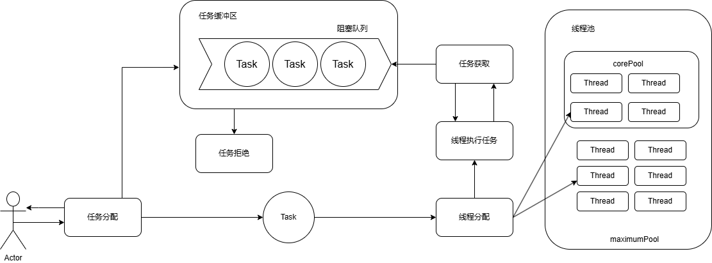

## introduce

> 线程池(Thread Pool)
> ，是一种基于池化思想管理线程的工具，用于降低资源消耗、提高响应速度、提高线程的管理性。池化技术的引入，可以有效的减少线程频繁申请/销毁和调度所带来的额外开销。对于池化思想，我们还能看到;内存池、连接池、化粪池。

| ArrayBlockingQueue    | -个用数组实现的有界阻塞队列，此队列按照先进先出(FIFO)的原则对元素进行排序。支持公平锁和非公平锁。                                                                                                              |
|-----------------------|-------------------------------------------------------------------------------------------------------------------------------------------------------------------|
| LinkedBlockingQueue   | 一个由链表结构组成的有界阻塞队列，此队列按照先进先出(FIFO)的原则对元素进行排序。此队列的默认大小是 Integer.MAX_VALUE，所以如果不设置的话队列的容量是巨大的。                                                                        |
| PriorityBlockingQueue | 一个支持优先级排序的无界阻塞队列，需要相应的对象进行排序，也可以自定义实现compareTo()方法来指定元素的排序观则，不能保证同优先级元素的顺序。                                                                                       |
| DelayQueue            | 一个实现PriorityBlockingQueue实现延迟获取的无界阻塞队列，在创建元素时，可以指定多久才能从队列中获取到元素。只有到期的消息才能从队列中获取元素                                                                                 |
| SynchronousQueue      | 一个不存储元素的阻塞队列，每一个put操作必须等待一个take操作，否则不能继续添加元素。支持公平锁和非公平锁。Executors.newCachedThreadPool()就使用了SynchronousQueue，这个线程池根据需要(新任务到来时)创建新的线程，如果有空闲线程则会重复使用，线程空闲超过60秒后会被回收。 |
| LinkedTransferQueue   | 一个由链表结构组成的无界阻塞队列，相当于其他队列，LinkedTransferQueue除了实现了transfer和tryTransfer方法。                                                                                          |
| LinkedBlockingDeque   | -个由链表结构组成的双向阻塞队列。队列支持FIFO和LIFO两种操作模式，多线程并发性好，可以快速的完成任务的移动与移除一端。                                                                                                   |

